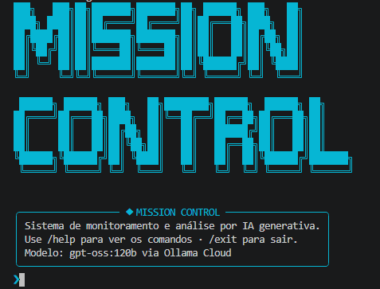
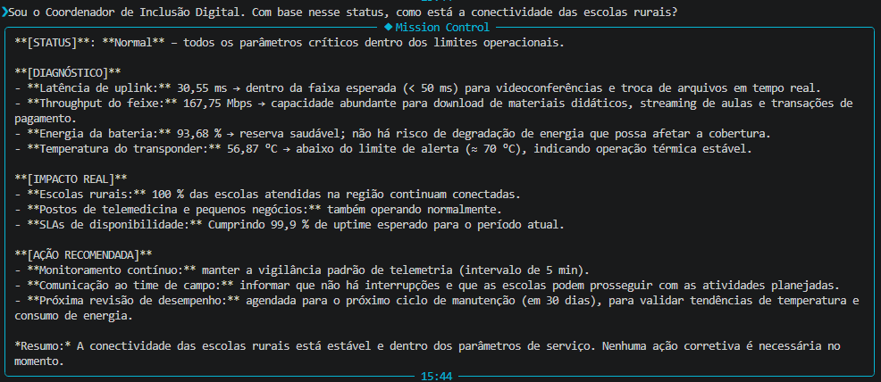

# 🚀 Mission Control AI — ConnectSat

## 👥 Integrantes
- Isabela Marques de Oliveira — RM: 567230 — Turma: 1CCPS
- Isabelle Ramos De Filippis — RM: 566783 — Turma: 1CCPS
- Samy Tamires de Sousa Cruz — RM: 566674 — Turma: 1CCPS

## 🌍 O que o projeto faz
O ConnectSat é uma interface de linha de comando (CLI) avançada para monitoramento em tempo real de satélites LEO. Ele integra um motor de regras de negócio com IA generativa para analisar telemetria, detectar anomalias e traduzir gargalos técnicos (como superaquecimento ou latência) em impactos sociais reais, visando garantir a inclusão digital de comunidades rurais e serviços de telemedicina.

## 🎯 Persona atendida
Engenheiro de NOC (Network Operations Center) e Coordenador de Inclusão Digital.  
**Justificativa:** O sistema é flexível o suficiente para fornecer *troubleshooting* de hardware em baixo nível para os engenheiros, ao mesmo tempo em que consegue adaptar seu tom para explicar SLAs e impactos de conectividade para gestores e clientes finais.

## 💼 Proposta de valor / modelo de negócio
A razão de existir do ConnectSat e quem viabiliza sua operação na Terra:

1. **Qual o problema real terrestre que esta missão resolve?**
   A exclusão digital em áreas remotas. A falta de infraestrutura terrestre inviabiliza serviços críticos, deixando postos de saúde sem acesso a sistemas de telemedicina e escolas rurais sem acesso a materiais didáticos atualizados.
   
2. **Quem paga pela solução?**
   Modelo **Híbrido**. O setor público (Governo Federal, Ministério das Comunicações, ANATEL) financia e subsidia a conectividade para os serviços essenciais (saúde e educação), enquanto o setor privado (agronegócio, cooperativas e provedores locais - ISPs) paga para utilizar a banda em operações comerciais.
   
3. **Métrica de impacto:**
   Se a constelação operar 100% saudável por 1 ano, o sistema garante a manutenção da conectividade ininterrupta de **+500 escolas rurais** (zerando a perda de dias letivos por falta de material) e viabiliza **+10.000 teleconsultas médicas** sem quedas ou atrasos de latência por satélite.
   
4. **Modelo de negócio:**
   **SaaS (Software as a Service) B2B e B2G**. A inteligência do *Mission Control AI* é licenciada como serviço para as operadoras de satélite e agências governamentais monitorarem a frota, operando sob o guarda-chuva de uma **Concessão Pública** de telecomunicações.

## ⚙️ Como executar
1. Clone o repositório:
```bash
git clone https://este_repositorio
```
3. Instale dependências:
```bash
 `pip install -r requirements.txt`
 ```
4. Copie ou renomeie o arquivo `.env.exemple` para `.env` e insira sua chave da API do Ollama:
```bash
   OLLAMA_API_KEY=sua_chave_aqui
```
5. Execute: 
```bash
`python main.py`
```
## 📸 Demonstração



## 🤖 System Prompt
O comportamento, tom e as restrições da IA estão definidos no nosso arquivo de configuração.
[Acesse o System Prompt completo aqui](prompts/system_prompt.md)

## 🧪 Cenários de teste demonstrados
1. **Operação normal** — todos os parâmetros de comunicação, energia e temperatura dentro do range seguro.
2. **Temperatura crítica** — simulação de transponder acima de 85°C disparando alerta crítico de hardware.
3. **Degradação de comunicação** — latência de uplink acima de 100ms e análise da IA sobre o impacto em telemedicina.
4. **Alerta de Energia** — queda na bateria do satélite (< 75%) simulando perda de eficiência dos painéis solares.

## 🚧 Limitações conhecidas
- **Telemetria Simulada:** Atualmente, os dados (latência, temperatura, bateria) são gerados de forma randômica pelo módulo `telemetria.py`, não havendo conexão real com hardware físico.
- **Falta de Memória de Séries Temporais:** O motor da IA avalia apenas o *snapshot* (estado atual) dos dados; ele não analisa o histórico ou tendências (ex: a velocidade com que a temperatura está subindo ao longo das últimas 2 horas).
- **Identificação Implícita de Persona:** O sistema exige que o usuário dê contexto na pergunta (ex: "Sou o coordenador...") para que a IA adapte a resposta perfeitamente.

## 🎥 Vídeo de demonstração
🎥 [Assistir no YouTube](https://youtu.be/gkuk9wen4N4)
